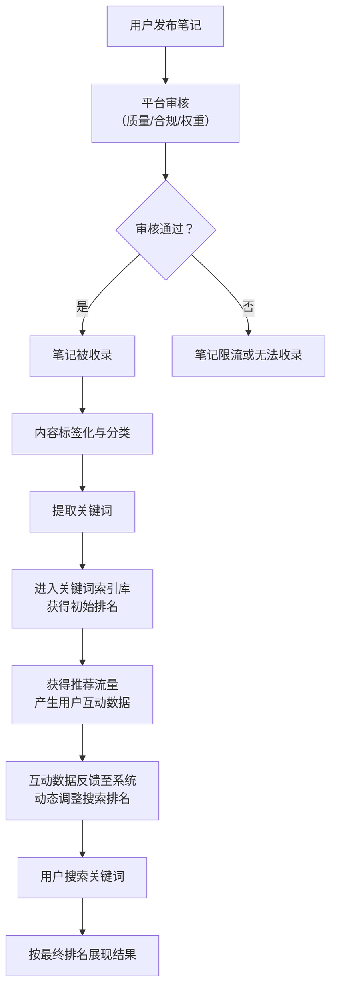

# 新媒体运营：P31：13：小红书关键词搜索排名机制详解（下） 🔍

在本节课中，我们将深入探讨小红书笔记从发布到进入搜索引擎索引库，再到最终获得搜索排名的完整流程。理解这套机制，是优化笔记、提升搜索曝光的关键。

上一节我们介绍了小红书搜索排名的基本概念和影响因素，本节中我们来看看一篇笔记从诞生到出现在搜索结果中的具体旅程。

---

## 笔记发布与平台审核 📝

流程的第一步是用户发布笔记。这属于用户操作，尚未涉及平台系统。

接下来是第二步：平台对内容进行审核。审核通常包括**机器审核**、**查重检测**和**人工审核**几个阶段。只要在机器审核中无重大问题，且账号权重尚可，笔记就会进入正常的分发阶段。

> 注意：分发阶段涉及的是数据展现，与我们本节重点讨论的搜索排名是不同但相关的环节。

## 笔记收录的前提条件 ✅

内容审核通过，且账号无违规问题后，笔记便会被系统**收录**。

笔记被收录有几个核心前提，系统在审核阶段就会进行评估：

1.  **笔记质量**：评估维度包括图片是否高清、文案是否通顺、内容是否垂直聚焦于某个领域、是否为用户提供了价值。目前可观测的质量点主要是内容通畅度和是否含有未报备的广告。
2.  **笔记合规性**：检查笔记中是否含有违规内容，如敏感词、法律禁止信息或未报备的广告。
3.  **账号权重**：系统会分析账号在所发布笔记领域内的专业度和历史表现。例如，一篇穿搭笔记，若来自穿搭领域的“专家”账号，其初始质量评分会更高。

当这三项评估均无大问题时，笔记即被视为高质量内容，进入**收录环节**。这意味着笔记被小红书的系统放入其索引库的预备队列中。

## 内容标签化与分类 🏷️

笔记被收录后，系统会对其进行**标签化**处理，即给笔记打上各种标签。

例如，一篇关于穿搭的笔记，可能会被打上“穿搭”、“T恤”、“牛仔裤”等标签。这些标签决定了笔记未来有潜力在哪些搜索词下被展现。

打上标签后，系统会进一步对笔记内容进行**分析**，提取核心**关键词**。例如，从“秋季高级感穿搭”的内容中，可能提取出“秋季”、“穿搭”、“高级感”等关键词。

## 进入索引库与初始排名 📊

提取关键词后，笔记会被分配到对应关键词的“流量池”中。系统会根据笔记质量、账号权重等因素，赋予笔记一个**初始排名分值**，这决定了它在池子中的初步位置。

然而，这个排名并非一成不变。笔记通过审核后，会进入推荐分发阶段，获得初始曝光。此时产生的**用户互动数据**（如点赞、收藏、评论、点击率、浏览时长）将至关重要。

这些数据会反馈到索引库中，动态影响笔记的排名。例如，一篇初始排名第10的笔记，如果点击率和互动率异常高，系统可能会提升它的排名分值，使其位置上升。

## 用户搜索与结果展现 🔎

当用户在前端搜索某个关键词时，小红书的搜索引擎会瞬间从索引库中调取与该关键词相关的笔记，并按照既定的排名顺序展现给用户。

最终呈现在用户眼前的，就是**搜索结果排名**。这套机制是小红书乃至许多内容平台的通用搜索逻辑。

为了帮助大家更好地理解这个抽象流程，下面我们通过一个具体案例来完整演示一遍。

---

## 案例演示：一篇笔记的搜索排名之旅 ✈️

假设我们发布了一篇笔记，标题为：《在泰国旅游发现一款超好喝的本地椰子汁品牌！旅行中的小惊喜》。我们的目标是让它在“泰国椰子汁”这个关键词下获得好的搜索排名。

以下是系统处理这篇笔记的完整步骤：

1.  **用户发布笔记**：发布关于“泰国椰子汁”的笔记。
2.  **平台审核笔记**：笔记通过机器与人工审核，账号无违规。
3.  **笔记被收录**：满足质量、合规、权重要求，进入系统索引库预备队列。
4.  **系统打标签**：系统为笔记打上多个标签，例如：`椰子汁`、`旅游`、`泰国`、`旅行`、`椰子汁品牌`。
5.  **内容分析与分类**：系统分析笔记内容，确定其主要领域（如“美食饮品”下的“椰子汁”），也可能附带关联领域（如“旅游”）。分类依据是内容主题和关键词频率，并非所有标签都会成为主分类。
6.  **提取关键词**：从笔记中提取出可能被搜索的关键词，例如：`泰国椰子汁`、`椰子汁品牌`、`好喝的椰子汁`、`泰国旅游`等。
7.  **进入索引库并获初始排名**：笔记被放入上述关键词对应的分类索引库中，并获得一个初始排名（例如，在“泰国椰子汁”词条下排名第15）。
8.  **互动数据影响排名**：笔记获得推荐流量后，用户的高点击率、点赞、收藏等正向数据会提升其在索引库中的排名分值（例如，从第15名升至第5名）。
9.  **结果展现**：当用户搜索“泰国椰子汁”时，系统按更新后的排名，将笔记展示在对应的结果位置。

通过这个案例，我们可以清晰地看到，搜索排名是一个贯穿笔记发布前、后，并持续受用户行为影响的动态过程。

---

## 核心总结 📝

本节课中我们一起学习了小红书关键词搜索排名的核心机制。我们可以将其精髓总结为以下流程图：

作为运营者，我们的目标不是深究每个算法细节，而是**将流程中每一个我们可以优化的环节做到极致**。从提升笔记质量和垂直度，维护账号健康，到通过优化内容促进用户互动，每一步都影响着笔记最终的搜索表现。

如果你的笔记遇到搜索不到、流量低迷的问题，不妨对照这个流程，逐一排查问题环节，并针对性地进行优化。记住，搜索流量和推荐流量相辅相成，共同构成小红书笔记的完整曝光体系。