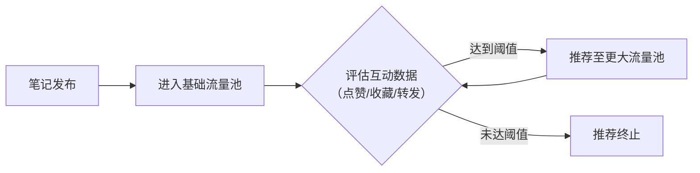

# 小红书开店运营教程：P4：小红书流量推荐机制讲解！ 📈

在本节课中，我们将要学习小红书平台的核心流量推荐机制。理解这套机制，是做好内容运营、提升笔记曝光的关键。其逻辑与抖音、头条等平台相似，都基于用户和内容的标签系统。

## 内容审核与标签匹配

上一节我们介绍了内容创作的基础，本节中我们来看看内容发布后如何被系统处理。小红书的推荐机制始于内容审核与标签匹配。

用户及内容都会被系统打上相应的标签。在发送笔记时，系统会为笔记打上标签。每篇笔记都会进行机器审核，检测内容是否违规。若未发现违规，笔记将进入大数据算法匹配分发流程。

这里涉及上一节课提到的违禁词检测。如果系统算法检测到疑似违规内容，但无法完全确定，则会将该笔记提交给人工进行二次审核。只有人工审核确认无误后，笔记才能进入分发匹配环节。

反之，如果笔记被机器判定违规，且经人工复核后也确认违规，该笔记将无法获得推荐，账号也可能受到限制发言等处罚。

## 内容分发与用户匹配

在推荐时，系统会提取笔记中的关键词、图片标签、话题等信息，将其分类到对应的内容类目中。这与用户注册时的选择密切相关。

用户在一开始注册小红书时，平台会要求选择地理位置和感兴趣的领域。此举旨在为用户打上“兴趣标签”。系统随后会根据这些兴趣标签，向用户匹配和分发相关的笔记内容。

## 笔记收录与搜索可见性

需要明确的是，笔记被推荐，并不等同于用户一定能通过搜索找到它。笔记必须被小红书“收录”后，才能在搜索中被找到。

以下是关于“笔记收录”的重要提醒：
目前，声称能“百分之百保证”小红书收录的服务或机构，几乎是不可能的。如果遇到此类承诺，需要高度警惕，其中很大概率存在欺诈。在考虑合作前，务必先验证对方的能力，切勿直接转账。

根据当前的操作经验，让笔记被小红书收录本身具有一定难度。

## 核心推荐机制：阶梯式流量池

很多人觉得小红书的推荐机制难以捉摸，例如一篇笔记的阅读量可能在20分钟内是1万，过一会儿又增长到更多。这其实源于其阶梯式的流量池推荐模型。

为了便于理解，我们可以用以下模型来描述这个过程：

1.  **初始流量池**：笔记发布后，系统会将其分配到一个**基础流量池**中。这个池子的曝光量通常不大，可能只有一两百或两三百次展示。
2.  **数据评估**：系统会根据笔记在基础流量池中的表现来评估其质量。核心评估参数包括：**点赞数、收藏数、转发数**。
3.  **流量升级**：如果笔记的**点赞、收藏、转发**等数据参数达到了进入下一级流量池的**阈值**，系统就会将其推荐给更大的**二级流量池**（例如1000次曝光）。
4.  **逐级放大**：在二级流量池中，系统会继续监测上述参数。如果数据表现依然优秀，达到新的阈值，笔记将被推荐到**三级流量池**（例如5000次曝光），以此类推，可能达到1万、1.5万甚至更高。
5.  **推荐终止**：如果笔记在某一级流量池中的数据反馈未能达到进入下一级的阈值，推荐就会停止在该级别。

因此，小红书的推荐并非一蹴而就，而是笔记凭借优质内容获得正向反馈后，**逐步被“炒热”** 的过程。不存在笔记一发出去就立刻获得海量曝光的情况，它是一个基于数据表现的、循序渐进的放大机制。

## 总结

本节课中我们一起学习了小红书的流量推荐机制。我们了解到，系统通过**标签系统**进行内容分类和用户匹配，并通过**阶梯式流量池**模型，依据笔记的**点赞、收藏、转发**等核心互动数据来决定是否将其推荐给更多用户。理解这个“数据驱动、逐级放大”的原理，对于我们后续优化内容、提升笔记表现至关重要。