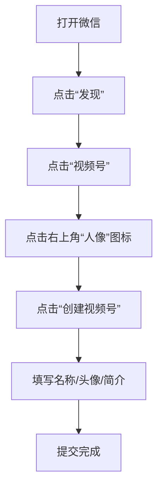

# 视频号运营教程：P20：8. 如何开通视频号

## 概述
在本节课中，我们将学习如何开通微信视频号。我们将通过一个真实的学员案例，详细拆解开通视频号的每一步操作，确保即使是零基础的初学者也能轻松完成。

---

## 案例背景介绍
上一节我们介绍了视频号运营的基本概念，本节中我们来看看如何实际操作开通。为了让大家更直观地理解，我将分享一位学员的真实案例。

这位学员是周建国先生，他今年63岁，识字不多，对互联网操作也不熟悉。他希望通过学习视频号运营，获得一些收入来补贴家用。这个案例证明，只要方法得当，任何人都能学会。

## 开通视频号的具体步骤
以下是开通视频号所需的完整步骤。我将以指导周先生的过程为例，用最直白的方式讲解。

**第一步：进入微信发现页**
打开微信，点击底部导航栏的 **“发现”** 按钮。

**第二步：找到视频号入口**
在“发现”页面中，找到并点击 **“视频号”** 入口。

**第三步：进入创建页面**
进入视频号页面后，点击右上角的 **“人像”** 图标，进入个人中心。然后，点击 **“创建视频号”** 按钮。

**第四步：填写基本信息**
根据页面提示，依次填写视频号的**名称**、**头像**、**简介**等基本信息。完成后，勾选同意协议并提交。

为了帮助周先生这样识字困难的学员，我制作了一张带箭头的指引图。箭头指向哪里，就点击哪里。这个方法简单有效。

## 核心要点总结
本节课中我们一起学习了开通视频号的完整流程。关键在于**按图索骥**，跟随清晰的指引一步步操作。无论年龄大小或对互联网是否熟悉，只要按照上述步骤进行，都能成功开通自己的视频号。

记住，**没有学不会的学生，只有不会教的老师**。遇到操作问题时，将大步骤拆解成一个个小动作，是解决问题的好方法。

---
**提示**：你可以将本教程中的步骤图保存下来，作为操作指南。如果在操作中遇到任何问题，可以随时回顾这些步骤。