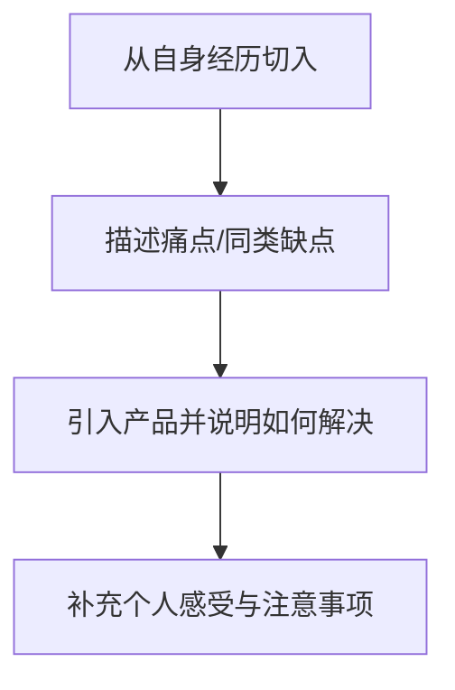

# 小红书运营教程：P6：小红书种草笔记写作4大步骤！📝

## 概述
在本节课中，我们将学习如何撰写一篇优秀的小红书种草笔记。我们将拆解为四个核心步骤，从素材准备到最终检查，帮助你掌握一套适用于所有产品的写作方法，避免笔记变成生硬的广告。

在开始之前，我们需要达成一个共识。分析小红书平台可以发现，绝大多数用户喜欢在这里发现和分享好物。因此，平台的主旋律是**种草笔记**。平台本身也推荐用户创作这类内容。掌握种草笔记的玩法，后续的引流、变现或推广都会水到渠成。许多人后期遇到引流或变现困难，问题往往出在笔记的风格和内容方向上。所以，我们的共识是：最好在小红书上创作种草类型的笔记。

说到种草笔记，很多人容易写成硬广。就像在抖音上看到的一些好物推荐视频，感觉每一句话都在为商品做宣传。本节课的核心就是解决这个问题：如何规避硬广感，让笔记看起来更自然。

## 第一步：寻找与整理素材 🖼️
本节我们将学习如何为笔记准备图片素材。一篇笔记需要从不同角度展示商品，图片是直观呈现卖点的关键。

以下是四种需要准备的素材图片类型：
*   **产品图**：展示商品外观，通常需要2-3张。
*   **效果图**：展示商品使用后的效果，通常需要1-2张。
*   **细节图**：从各个角度、方位或使用场景展示商品细节，通常需要1-2张。
*   **使用图**：展示亲身使用商品过程的照片，通常需要1-4张。

根据不同的行业类目，所需图片类型有所不同。下表列出了不同类目的图片使用建议（标横线的表示不需要）：
| 行业类目 | 产品图 | 效果图 | 细节图 | 使用图 |
| :--- | :--- | :--- | :--- | :--- |
| 服装 | 需要 | 需要 | ~~不需要~~ | ~~不需要~~ |
| 母婴 | 需要 | 需要 | 需要 | 需要 |
| 电器 | 需要 | 需要 | 需要 | 需要 |
| 食品/美妆 | 需要 | ~~不需要~~ | 需要 | ~~不需要~~ |

那么，如何找到这些图片呢？推荐一个主要渠道：**淘宝/天猫**。以“泡脚桶”为例：
*   **产品图**：直接在商品详情页获取。
*   **效果图/使用图/细节图**：在商品的“评价”或“买家秀”区域寻找带图评价，这些是真实的使用反馈和图片，可以整合分类。

## 第二步：撰写标题与正文 ✍️
上一节我们准备好了素材，本节中我们来看看如何撰写吸引人的标题和有说服力的正文。文案部分包含标题和正文两大部分。

### 如何撰写标题
标题需要突出商品的核心卖点。优化方法是在原标题中加入能体现商品特点或优势的词汇。

**优化案例对比：**
*   **原标题**：男朋友挑选的圣诞礼物，蒸气足浴盆。
*   **优化后**：无需倒水的蒸汽足浴盆，男朋友挑选的。
*   **核心技巧**：在标题中加入如“无需倒水”、“少女心爆棚”等体现商品独特卖点的词汇。

### 如何撰写正文
如果正文通篇都是卖点，就会像硬广，不易被平台推荐。我们需要一个有层次、有逻辑的写作框架。

以下是建议的正文写作步骤流程图：

**1. 从自身经历切入：**
使用第一人称“我”来写，营造亲切感和代入感。避免以专家或商家的口吻开头。
*   **普通写法**：很多女生到了冬天脚都很冷。
*   **推荐写法**：我是一个女生，到了冬天脚就特别冷，从来没暖和过。

**2. 描述痛点与缺点：**
描述要具体、清晰，但无需罗列过多。重点是与你要推广的商品形成对比。
*   **示例（泡脚桶）**：
    *   别家产品：有安全隐患、残留水垢、熏蒸口设计不合理容易刮伤小腿。
    *   别家产品：操作复杂，需要不停调试多个按钮。
    *   别家产品：水电未分离，安全性存疑；加温方式导致水温不均。

**3. 引入产品并说明解决方案：**
针对上述痛点，自然引入你的产品，并说明其优势。
*   **写作角度**：
    1.  你的产品如何解决上述痛点。
    2.  对比同类产品，你的产品有哪些额外优势。
    3.  直接给出最佳解决方案。
*   **示例（泡脚桶）**：介绍产品具有一键启动、水电分离、K式循环加温（水温均匀）、防电磁干扰等优点。

**4. 补充个人感受与注意事项：**
在最后补充产品的其他优点、使用感受或保养注意事项，使内容更完整、可信。
*   **示例**：可以询问卖家，补充如“长时间不用该如何存放”等实用信息。

## 第三步：挖掘产品卖点与痛点 🔍
上一节我们介绍了正文的写作框架，本节中我们来看看如何有效地挖掘产品的核心卖点和市场痛点，这是支撑正文内容的关键。

最直接有效的方法是参考**淘宝/天猫等电商平台的商品详情页和客服问答**。商家为了销售，会深入研究并突出自己产品的优势和市场普遍问题。
*   **寻找核心卖点**：仔细阅读商品详情页，提炼出商家重点宣传的功能和优势。
*   **发现痛点与普遍缺点**：查看商品评价中的负面反馈，或直接咨询客服：“你家产品比别人家好在哪里？”、“这个行业常见的问题是什么？”。例如，泡脚桶行业可能普遍存在“设计不适合亚洲人腿型，容易刮伤”的问题。

## 第四步：图片处理与最终检查 ✅
本节我们将完成最后两步：美化笔记图片并进行发布前的全面检查。

### 图片处理要求
小红书笔记的图片主要分为两种：
1.  **封面首图**：需要吸引眼球。建议使用**产品图**，并添加文字、特效。推荐使用 **黄油相机** 或 **美图秀秀** 进行美化。黄油相机的滤镜和字体模板效果很好，免费功能已足够使用。
2.  **文章配图**：即笔记正文中的图片。建议准备**5-8张**，可以包含产品图、效果图、细节图、使用图等，并可以添加文字说明或标签。

### 最终检查工作
在发布前，请务必进行以下检查：
*   **检查文字**：纠正错别字；排查并替换**敏感词**（第一课已详细说明）；文字不要过于密集，**适当换行**；**多使用表情符号**，让行文更生动。
*   **检查图片**：确保所有图片**没有第三方水印和二维码**。

**优秀笔记范例参考：**
*   **首图**：美观，带有标签，信息清晰。
*   **配图**：有详细的介绍图。
*   **正文**：段落分明，适当换行（如：干性肌肤、油性肌肤、混合性肌肤分段说明）；使用了丰富的表情符号（如星星、对勾、猴子等），使内容活泼有条理。

## 总结
本节课中，我们一起学习了撰写小红书种草笔记的四个核心步骤：
1.  **寻找与整理素材**：根据产品类目准备产品图、效果图、细节图和使用图。
2.  **撰写标题与正文**：标题突出卖点；正文按“自身经历 -> 痛点描述 -> 引入产品 -> 个人感受”的逻辑展开。
3.  **挖掘产品卖点与痛点**：参考电商平台详情页和客服信息，提炼产品优势和市场普遍问题。
4.  **图片处理与最终检查**：使用工具美化封面和配图；发布前仔细检查错别字、敏感词、排版和图片水印。

遵循以上四个步骤，你就能系统地创作出一篇高质量、自然且吸引人的小红书种草笔记。